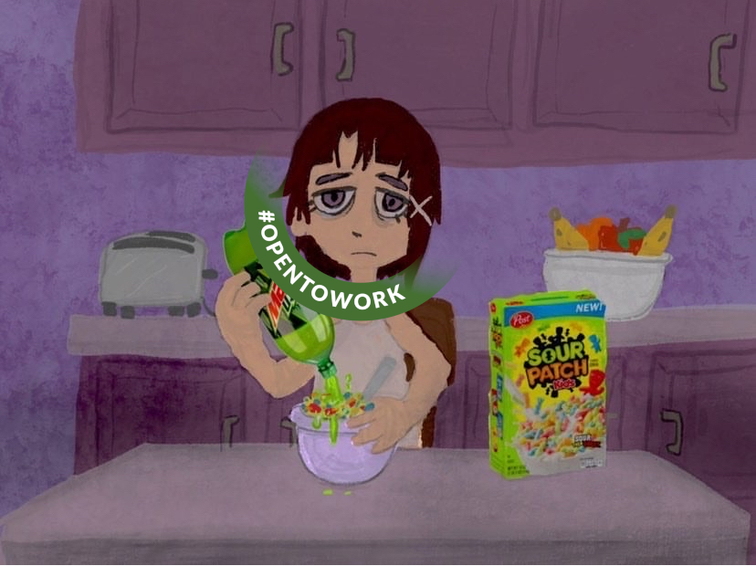

# NOT EVEN FIRST DRAFT

### About this book

If this is your first book about dlang; **don't**. This is a collection of rants about template meta-programming. Go read something else first: //todo expand list

[Dingbats](https://github.com/crazymonkyyy/dingbats)

[Programming is D(a bit overhyped but standard)](https://ddili.org/ders/d.en/index.html)

Read this along side or after [the template book](https://github.com/PhilippeSigaud/D-templates-tutorial); this book should be mandated reading for navigating template hell.

Making this at the earilest the 3rd book you read.

### Contributing

Im very open to grammer and spelling edits, not so with tone and opinion policing.
Geust chapters plz.

### Me

//todo crop

Im monkyyy, the grumpy asshole whos chornicaly unempoyed and seemly unable to finish a solo project. //todo
